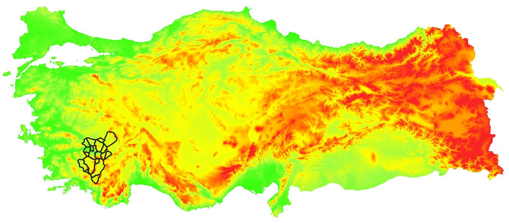

# QGIS Easy Raster Splitter Plugin

With this plugin, it is possible to split raster files based on given polygon data. For correct results please be sure that the layer and the canvas have the same coordinate reference system.

2 methods and 2 options are available for this process 

An illustrative example is shown below:
 

  

 

### 1-) Clip method.
In this method; the input raster is clipped by the provided polygon data(in vector format). After the process, the clipped parts are kept. 
#### a-) Split By Feature
The raster is clipped by features seperately. The names of the created rasters are read from the attribute table of the polygon data.

<table>
  <tr>
    <td></td>
    <td></td>
  </tr>
</table>

#### b-) Split By Full Vector
The raster is clipped by full vector. The names of the created raster is typed manually.

<table>
  <tr>
    <td></td>
    <td></td>
  </tr>
</table>

### 2-)Extract method.
In this method; the input raster is extracted by the provided polygon data(in vector format). After the process, the extracted parts are deleted. 

#### a-) Extract By Feature
The raster is extracted by features seperately. The names of the created rasters are read from the attribute table of the polygon data.

<table>
  <tr>
    <td></td>
    <td></td>
  </tr>
</table>

#### b-) Extract By Full Vector
The raster is extracted by full vector. The names of the created raster is typed manually.

<table>
  <tr>
    <td></td>
    <td></td>
  </tr>
</table>

